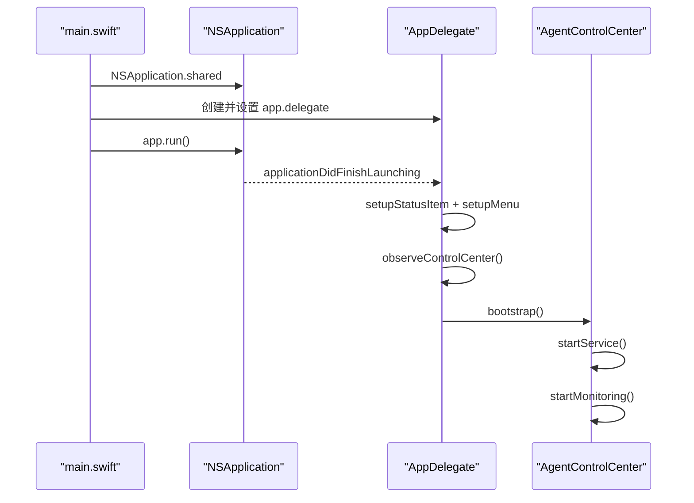
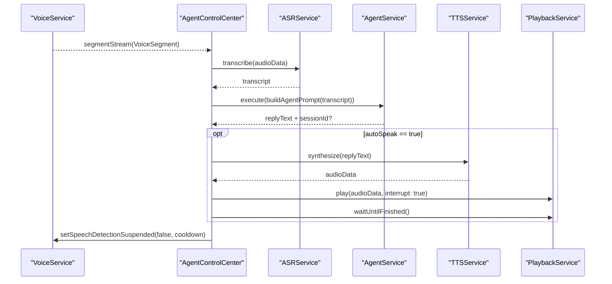

# iAgent 全工程时序说明

更新时间：2026-04-08

## 1. 文档范围

本文覆盖当前代码中的主时序：

- 应用入口、菜单栏生命周期、服务启动与停止
- 语音采集与 VAD 分段
- 语音主管线
- 播放状态传播、菜单栏图标/文本更新
- Agent CLI 会话 ID 续接
- 配置装载到行为生效的路径
- 错误传播与测试覆盖映射

不在范围内：

- 已移除的 HTTP server 旧链路
- 外部脚本 `scripts/welcome-home` 的运行时细节

## 2. 组件与职责

- `main.swift`：创建 `NSApplication` 与 `AppDelegate`，进入主事件循环
- `AppDelegate`：菜单栏 UI、Observation 绑定、退出流程
- `AgentControlCenter`：全局编排器，负责服务生命周期、状态绑定与主管线调度
- `VoiceService`：原生音频采集，负责 VAD、状态流和片段流
- `ASRService`：调用 ASR HTTP API，返回 transcript
- `AgentService`：调用 `qwen` CLI，并维护 `currentSessionId`
- `TTSService`：调用 TTS API，返回音频数据
- `PlaybackService`：通过 `AVAudioPlayer` 或 `afplay` 播放音频，并发出播放状态
- `ConversationMemory`：保存最近轮次对话

## 3. 总体时序链路

当前工程主要有 9 条时序链路：

1. 进程启动链路：`main.swift -> AppDelegate`
2. 菜单栏初始化链路：图标、菜单、Observation 绑定
3. 引导启动链路：`bootstrap -> startService`
4. 依赖探测链路：Agent CLI
5. 语音采集链路：原生采集 -> 帧读取 -> VAD
6. 语音主管线：`ASR -> Agent -> TTS -> Playback`
7. 播放状态传播链路：`PlaybackService.stateStream -> isPlaying -> Voice 抑制/恢复`
8. 会话续接链路：CLI sessionId 继承与覆盖
9. 停止/退出链路：任务取消、进程终止、状态回收

## 4. 启动与生命周期时序



补充：

- `bootstrap()` 会先 `Configuration.reload()`，再异步调用 `startService()`
- `startService()` 会先订阅 `VoiceService` 和 `PlaybackService` 的状态流，再启动语音监听，避免错过首个状态
- `AppDelegate` 不再轮询 `AgentControlCenter`
- 退出时会先 `await controlCenter.stopService()`，然后再 terminate

## 5. 语音采集与 VAD 分段时序

`VoiceService.runCaptureLoop()` 的关键阶段：

1. 进入原生 `NativeCaptureSession`
3. 按 `frameBytes` 持续读取 PCM 帧
4. 计算 RMS 并运行 VAD 状态机
5. 开口阈值命中后发出 `.speaking`
6. 若 `interruptOnSpeech && playbackIsActive`，先发出 `.interruptingPlayback`
7. 结束条件命中后：
   - 发出 `.processing`
   - 合并 `speechFrames` 为 `VoiceSegment`
   - 通过 `segmentStream` 投递片段
   - 立即挂起新的语音检测
8. 单段最长 8 秒，超时会强制收段
9. 整轮处理真正结束后，`VoiceService` 才重新发出 `.listening`

当前默认 VAD 参数来自 `Configuration.shared.client.continuous`：

- `frameMs = 30`
- `startThreshold = 1300`
- `playingStartThreshold = 2800`
- `endThreshold = 520`
- `startFrames = 5`
- `playingStartFrames = 8`
- `endSilenceFrames = 22`
- `prerollFrames = 16`
- `minSpeechFrames = 10`
- `postInterruptCooldownSeconds = 1.2`

自适应行为：

- 静默阶段按 4 秒窗口统计平均 RMS 和峰值
- 环境能量较低时会自动下调 `start/playing/end` 阈值
- 持续零能量约 8 秒会报错并进入恢复路径

## 6. 业务处理时序

### 6.1 语音主管线



状态变化：

- 片段进入处理：`statusMessage = "识别中..."`
- ASR 完成：`statusMessage = "识别完成: ..."`
- Agent 返回：`statusMessage = "回复: ..."`
- 播报中：`statusMessage = "播报中"`
- 播放完成后，才恢复 `listening`

## 7. 播放状态与菜单栏展示

### 7.1 播放状态传播

`playbackService.stateStream` 会驱动两件事：

1. `voiceService.setPlaybackActive(state == .playing)`
2. `AgentControlCenter.handlePlaybackState(_:)` 更新 `isPlaying` 与播报结束文案

### 7.2 菜单栏展示

`AppDelegate.observeControlCenter()` 通过 Observation 直接追踪：

- `controlCenter.health`
- `controlCenter.isPlaying`
- `controlCenter.statusMessage`
- `controlCenter.latestConversation`

图标规则：

- `isPlaying == true` -> `speaker.wave.2.fill`
- `isServiceRunning == true` -> `mic.fill`
- 其他 -> `mic`

文本规则：

- 新的用户内容或助手回复会临时显示 5 秒
- 若没有临时文本，菜单栏回退到 `statusMessage`

## 8. 会话续接时序

`AgentService.execute(prompt, sessionId: nil)` 的逻辑：

1. 计算 `effectiveSessionId = sessionId ?? currentSessionId`
2. Qwen 使用 `--resume <effectiveSessionId>`
3. 若本轮输出里解析到新的 `session_id`，覆盖 `currentSessionId`

## 9. 配置生效时序

运行时配置优先级：

1. 环境变量
2. `IAGENT_CONFIG_PATH` 指向的 JSON 文件
3. `~/Library/Application Support/iAgent/config.json`
4. 代码默认值

时序含义：

- `bootstrap()` 和 `startService()` 启动时都会 `Configuration.reload()`
- 现有 actor 在本次启动周期内不会自动热重载
- `runtimeDescription` 会显示 `audio: native`

## 10. 错误传播

主要错误路径：

- 启动依赖缺失：`startService` catch -> `health = .unreachable`
- 采集异常：`VoiceService.errorStream` -> `statusMessage = "采集异常: ..."`
- 语音处理异常：`processVoiceSegment` catch -> `statusMessage = "处理失败: ..."`
- `ASRError.noResult`：提示“ASR未识别到有效语音，请再说一次”，并增加额外冷却

## 11. 测试覆盖映射

当前 `iAgentTests` 主要覆盖：

- `AgentControlCenterVoiceTimingChainTests`
  - 语音主管线顺序与失败短路
- `AgentControlCenterCoverageTests`
  - 启动/停止、初始 `idle` 时序、防止错误恢复提示
- `AgentControlCenterPipelineTests`
  - transcript 路径与对话状态更新
- `VoiceServiceCaptureIntegrationTests`
  - 采集循环与 VAD 分段
- `VoiceServiceCoverageTests`
  - 原生采集、配置、保护分支、状态流
- `PlaybackServiceStateStreamTests` / `PlaybackServiceCoverageTests`
  - 播放状态流、等待与回退路径
- `AgentServiceSessionIntegrationTests`
  - Qwen 会话续接
- `ASRAndTTSLocalIntegrationTests`
  - ASR 本地 HTTP 解析与 TTS SSE 解析

统一运行命令：

```bash
xcodebuild -project iAgent.xcodeproj -scheme iAgent -configuration Debug test -only-testing:iAgentTests
```
